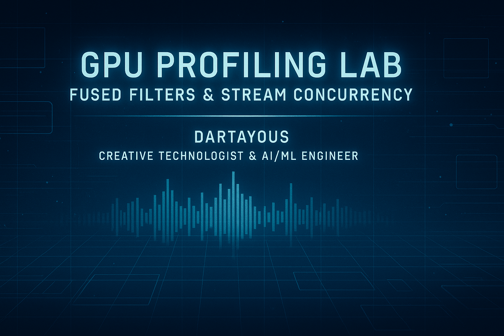
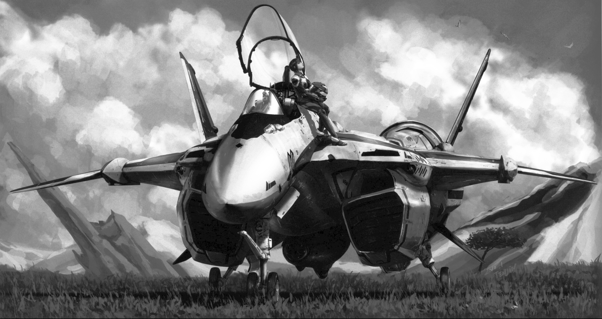
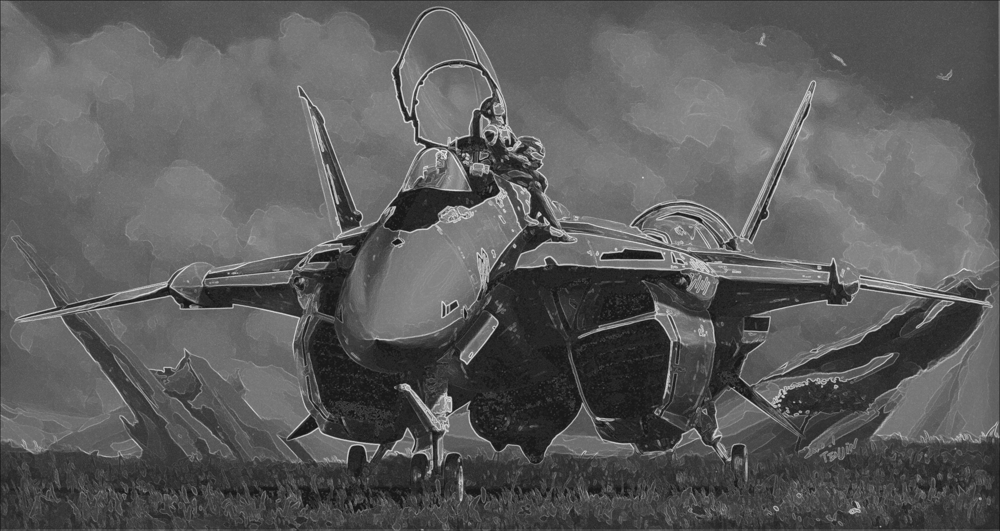

#  Custom CUDA Kernel with Stream Concurrency
A fused image processing pipeline using CUDA, Cupy, and NVTX—profiling kernel performance with Nsight Systems and visualizing execution in a dashboard-style notebook.

---

  

---

##  Input vs. Fused Output

#### Input Image

  

#### Fused Output

  

The fused output combines blur, brightness correction, and Sobel edge detection in a single GPU pass.

---

##  Pipeline Overview
* Preprocessing: Load grayscale image and transfer to GPU

* Fused Kernel: Apply blur → brightness → Sobel → blend

* Postprocessing: Transfer result back to CPU and save

All operations are wrapped in NVTX markers and launched inside a non-blocking CUDA stream for concurrency.

---

##  Kernel Summary
// CUDA kernel pseudocode
blur = average(3x3 neighborhood)
corrected = clamp(blur + brightness)
edge = sobel_x + sobel_y
output = (corrected + edge) / 2

Implemented using cp.RawKernel and launched with (16, 16) blocks.

---

##  Nsight Systems Timeline

*  Preprocessing: Image load and GPU transfer

*  Fused Kernel in Stream: CUDA kernel execution

*  Postprocessing: Result transfer and save

NVTX markers segment the timeline for clarity. Kernel execution time: ~X.XX ms

---

##  Performance Insights
* Fused kernel reduced launch overhead and memory latency

* Stream concurrency enabled overlap between compute and memory ops

* NVTX markers provided clear segmentation for profiling

---

##  Next Steps
* Add batch processing and multi-stream orchestration

* Expand to RGB image support

* Integrate Nsight Compute for SM occupancy and memory throughput

* Build a visual dashboard to compare fused vs. modular kernels

---

##  Notebook Preview
* Explore the full pipeline in GPU_Profiling_Storyboard.ipynb, including:

* Input/output previews

* Kernel summary

* Timeline analysis

* Performance commentary

---

## Install instructions
conda create -n gpu-lab --file requirements.txt

---
##  Author
#### Dartayous 
Creative Technologist & AI/ML Engineer 
Specializing in GPU profiling, modular pipelines, and cinematic documentation
